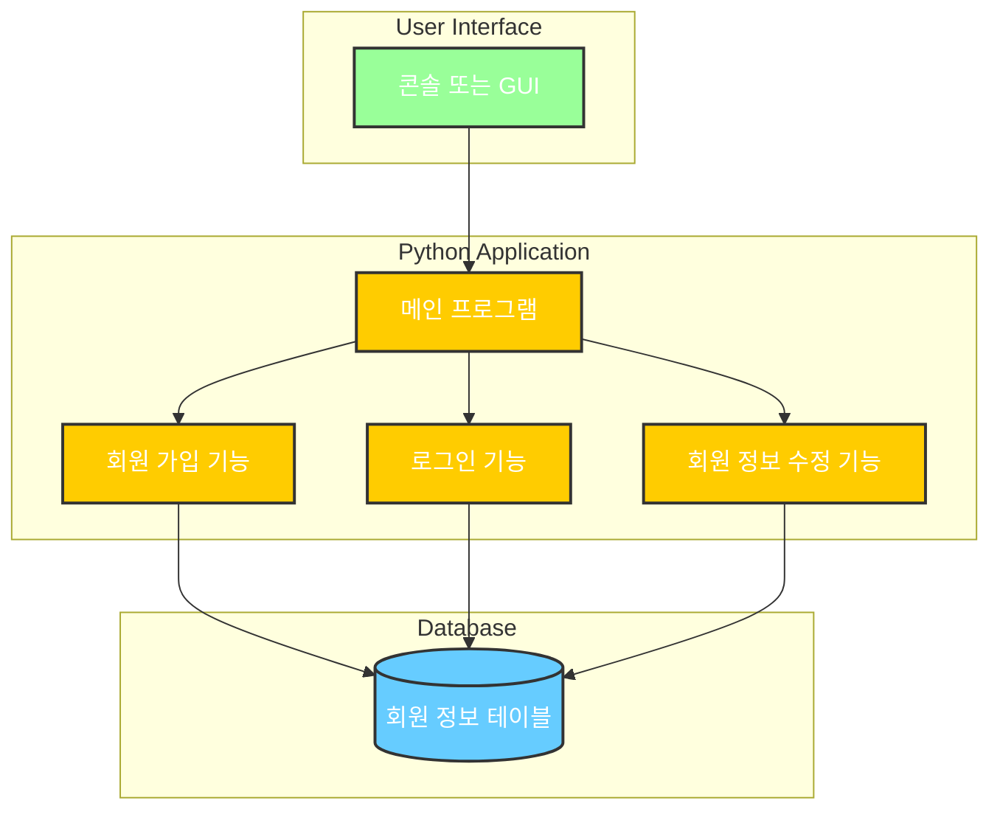

```mermaid
graph TD
    subgraph Python Application
        A[메인 프로그램]
        B[회원 가입 기능]
        C[로그인 기능]
        D[회원 정보 수정 기능]
    end

    subgraph Database
        E[(회원 정보 테이블)]
    end

    subgraph User Interface
        F[콘솔 또는 GUI]
    end

    F --> A
    A --> B
    A --> C
    A --> D

    B --> E
    C --> E
    D --> E

    %% 색상 및 글자 색상 지정
    style A fill:#ffcc00,stroke:#333,stroke-width:2px,color:#ffffff
    style B fill:#ffcc00,stroke:#333,stroke-width:2px,color:#ffffff
    style C fill:#ffcc00,stroke:#333,stroke-width:2px,color:#ffffff
    style D fill:#ffcc00,stroke:#333,stroke-width:2px,color:#ffffff

    style E fill:#66ccff,stroke:#333,stroke-width:2px,color:#ffffff

    style F fill:#99ff99,stroke:#333,stroke-width:2px,color:#ffffff
```